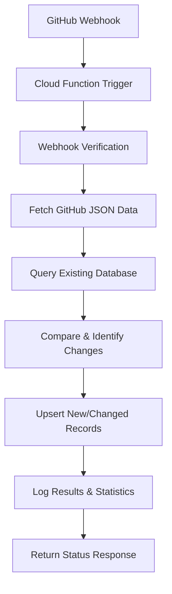

# Google Cloud Function - Project Overview

## 📁 Complete File Structure

```
cloud_function/
cloud_function/
├── main.py                      # Main webhook handler
├── requirements.txt             # Python dependencies
├── .env.yaml.example            # Environment configuration template
├── deploy.sh                    # Deployment script (executable)
├── test_local.py                # Local testing script (executable)
├── README.md                    # Comprehensive documentation
├── github-actions-example.yml   # GitHub Actions workflow example
└── OVERVIEW.md                  # This file
```

## 🚀 Quick Start

1. **Configure Environment**:
   ```bash
   cp .env.yaml .env.yaml.backup
   # Edit .env.yaml with your Supabase credentials
   ```

2. **Deploy to Google Cloud**:
   ```bash
   ./deploy.sh
   ```

3. **Test Locally** (optional):
   ```bash
   pip install -r requirements.txt
   export SUPABASE_URL="your-url"
   export SUPABASE_SERVICE_ROLE_KEY="your-key"
   python test_local.py both
   ```

## ✨ Key Features Implemented

### 🔧 Core Functionality
- ✅ **Webhook Handler**: Secure HTTP endpoint for GitHub webhooks
- ✅ **Database Updates**: Incremental updates to Supabase tables
- ✅ **Platform Selection**: Update Windows, Linux, or both
- ✅ **Error Handling**: Comprehensive error recovery and logging
- ✅ **New EDR Detection**: Automatically adds new vendors
- ✅ **Explanation Sync**: Handles "Partially" status explanations

### 🛡️ Security Features
- ✅ **Webhook Verification**: HMAC signature validation
- ✅ **Environment Variables**: Secure credential management
- ✅ **Input Validation**: Sanitized data processing
- ✅ **Error Sanitization**: No sensitive data in error responses

### 📊 Monitoring & Logging
- ✅ **Structured Logging**: Detailed operation logs
- ✅ **Performance Metrics**: Execution time tracking
- ✅ **Status Reporting**: Comprehensive response data
- ✅ **Cloud Logging**: GCP integration for log aggregation

### 🔄 Integration Features
- ✅ **GitHub Actions**: Workflow example for CI/CD
- ✅ **Manual Triggers**: Direct HTTP API calls
- ✅ **Batch Processing**: Efficient bulk updates
- ✅ **Idempotent Operations**: Safe to run multiple times

## 📈 Data Processing Flow



## 🎯 Response Examples

### ✅ Success Response
```json
{
  "timestamp": "2025-01-20T10:30:00Z",
  "platform": "both",
  "status": "success",
  "windows_stats": {
    "categories_added": 2,
    "scores_updated": 156,
    "errors": 0
  },
  "linux_stats": {
    "categories_added": 1, 
    "scores_updated": 84,
    "errors": 0
  },
  "duration_seconds": 4.2
}
```

### ❌ Error Response
```json
{
  "timestamp": "2025-01-20T10:30:00Z",
  "status": "failure",
  "error": "Connection to database failed",
  "duration_seconds": 1.5
}
```

## 🔗 API Endpoints

| Method | URL | Parameters | Description |
|--------|-----|------------|-------------|
| POST | `/edr-telemetry-updater` | `platform=both` | Update both platforms |
| POST | `/edr-telemetry-updater` | `platform=windows` | Update Windows only |
| POST | `/edr-telemetry-updater` | `platform=linux` | Update Linux only |

## 📊 Database Operations

### Tables Updated
- `windows_telemetry` → Categories and subcategories
- `windows_table_results` → EDR implementation status + explanations
- `linux_telemetry` → Categories and subcategories  
- `linux_table_results` → EDR implementation status

### Operation Types
- **INSERT**: New telemetry categories
- **UPSERT**: EDR scores (update if exists, insert if new)
- **UPDATE**: Status changes and explanations

## 🚨 Troubleshooting

### Common Issues
1. **Deployment Fails**: Check GCP authentication and project settings
2. **Database Errors**: Verify Supabase credentials and connectivity
3. **GitHub Webhook**: Confirm URL and webhook secret configuration
4. **Timeout Errors**: Increase function timeout or optimize queries

### Debug Commands
```bash
# View function logs
gcloud functions logs read edr-telemetry-updater --region=us-central1

# Test locally
python test_local.py windows

# Check function status  
gcloud functions describe edr-telemetry-updater --region=us-central1
```

## 📦 Dependencies

### Production
- `functions-framework` - Google Cloud Functions runtime
- `supabase` - Database client library
- `requests` - HTTP client for GitHub API
- `python-dotenv` - Environment variable management

### Development
- `unittest.mock` - Local testing framework
- `json` - Data serialization
- `logging` - Application logging

## 🔄 Maintenance

### Regular Tasks
- Monitor Cloud Function logs for errors
- Update Python dependencies quarterly
- Review and rotate webhook secrets
- Monitor database performance

### Scaling Considerations
- Adjust memory allocation based on data size
- Configure min instances for consistent performance
- Monitor Cloud Function quotas and billing
- Consider implementing caching for large datasets

## 📞 Support Contacts

- **GCP Issues**: Google Cloud Support
- **Database Issues**: Supabase Documentation  
- **GitHub Integration**: Repository webhook settings
- **Function Logic**: Review `main.py` and logs

---

🎉 **Ready to Deploy!** Follow the Quick Start guide above to get your automated EDR Telemetry database updates running.